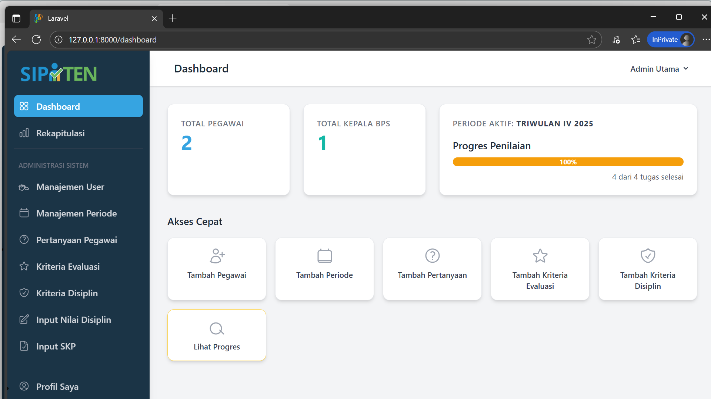
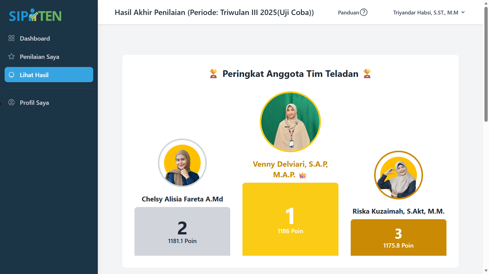
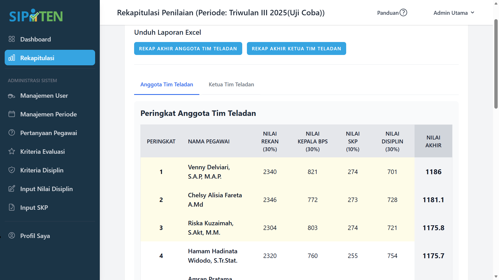
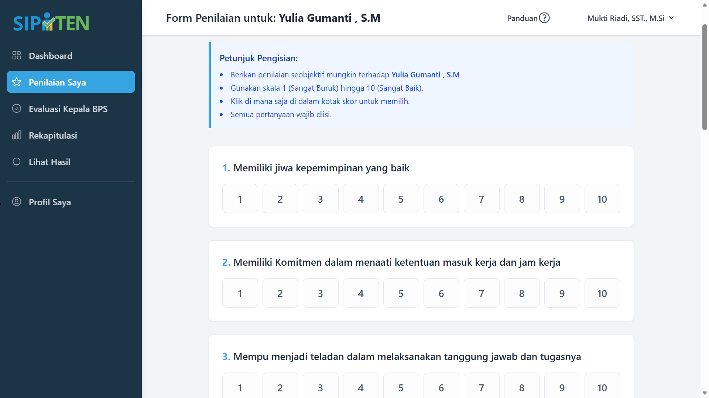
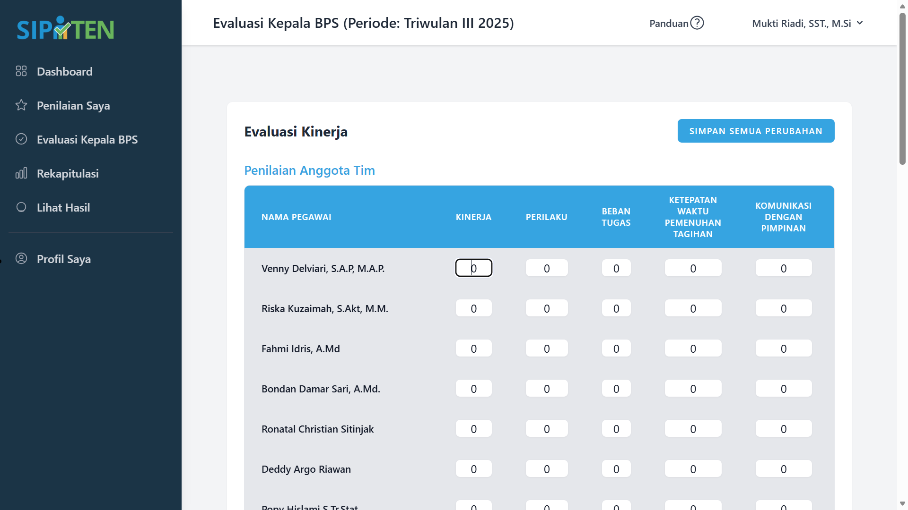
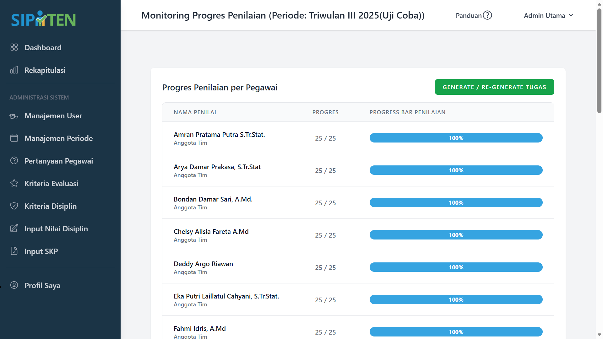
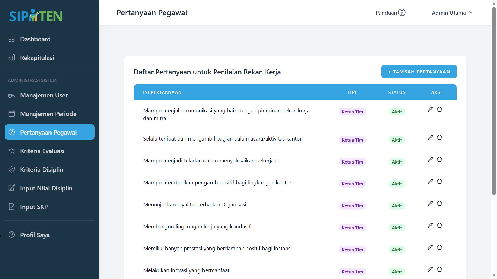

# 🏆 SIPATEN: Sistem Pendukung Keputusan Penilaian Kinerja Multi-Rater (360 Derajat)

<p align="center">
  <!-- Ganti 'dashboard-utama.png' dengan nama screenshot dashboard terbaik Anda -->
  
</p>

<p align="center">
  <a href="#-tentang-proyek">Tentang Proyek</a> •
  <a href="#-galeri-antarmuka">Galeri Antarmuka</a> •
  <a href="#-fitur-unggulan">Fitur Unggulan</a> •
  <a href="#-arsitektur-teknis">Arsitektur Teknis</a> •
  <a href="#-bedah-algoritma-saw">Bedah Algoritma</a> •
  <a href="#-panduan-instalasi">Instalasi</a>
</p>

---

## 📖 Tentang Proyek

**SIPATEN (Sistem Penilaian Pegawai Teladan)** adalah sebuah Sistem Pendukung Keputusan (SPK) skala *Enterprise* yang dirancang khusus untuk memodernisasi dan mengotomatisasi proses evaluasi kinerja di lingkungan Badan Pusat Statistik (BPS) Kabupaten Muara Enim. 

Sistem ini mentransformasi proses penilaian manual yang rentan bias dan *human error* menjadi sebuah alur kerja digital yang terstruktur. Mengadaptasi filosofi manajemen SDM modern, SIPATEN menerapkan pendekatan **Multi-Rater (Penilaian 360 Derajat)** yang memadukan penilaian subjektif (dari rekan kerja dan pimpinan) dengan data kinerja objektif (SKP dan Disiplin). Seluruh aliran data multidimensi ini kemudian diagregasi secara matematis menggunakan algoritma **Simple Additive Weighting (SAW)** untuk memberikan rekomendasi keputusan yang presisi, transparan, dan dapat dipertanggungjawabkan bagi pengambil kebijakan.

---

## 📸 Galeri Antarmuka

Berikut adalah tampilan dari beberapa fitur utama dalam aplikasi SIPATEN:

<p align="center">
  
  
</p>
<p align="center">
  <i>(Kiri) Podium Pemenang 3 Besar yang interaktif. (Kanan) Tabel Rekapitulasi Akhir dengan rincian skor.</i>
</p>

<p align="center">
  
  
</p>
<p align="center">
  <i>(Kiri) Antarmuka formulir Peer-to-Peer Review. (Kanan) Antarmuka matriks Evaluasi Kepala BPS.</i>
</p>

<p align="center">
  
  
</p>
<p align="center">
  <i>(Kiri) Dashboard Monitoring Progres Real-time. (Kanan) CRUD Manajemen Kriteria & Pertanyaan Dinamis.</i>
</p>

---

## ✨ Fitur Unggulan

### 1. Ekosistem Multi-Peran Dinamis (*Role-Based Access Control*)
Aplikasi ini mendefinisikan empat otorisasi ketat:
*   **Admin:** Pengendali infrastruktur sistem, parameter periode, dan konfigurasi master data.
*   **Bagian Umum:** Eksekutor input data administratif kuantitatif (SKP Bulanan & Matriks Disiplin).
*   **Pegawai:** Partisipan aktif dalam ekosistem *Peer-to-Peer Review*.
*   **Kepala BPS (Eksekutif):** Evaluator final dan pemegang otoritas publikasi hasil.

### 2. Engine Penilaian 360 Derajat Terpadu
Sistem secara cerdas menangani kompleksitas penilaian multi-arah tanpa intervensi manual.
*   **Automated Assignments:** Algoritma internal secara otomatis men-*generate* tugas penilaian *peer-to-peer*, memastikan setiap pegawai menilai rekan yang tepat (dengan aturan eksklusi yang ketat).
*   **Target-Specific Criteria:** Kepala BPS disajikan antarmuka evaluasi dinamis yang membedakan kriteria penilaian secara spesifik antara "Pegawai Biasa" dan "Ketua Tim".

### 3. Otomatisasi Kalkulasi SPK (*Calculation Engine*)
Menggantikan puluhan rumus *spreadsheet* yang rentan patah, sistem mengolah ratusan titik data mentah secara seketika (*on-the-fly*). Sistem memproses skala data yang berbeda dan menerapkan pembobotan algoritmik yang presisi untuk menghasilkan klasemen akhir.

### 4. Birokrasi Digital & Generator Laporan Komprehensif
Mengadaptasi alur persetujuan (*approval workflow*) pemerintahan, hasil kalkulasi algoritma harus dikunci melalui aksi **Publikasi Eksekutif**. Setelah dipublikasikan, sistem secara otomatis:
*   Menyajikan "Podium Pemenang" visual di *dashboard* seluruh pegawai.
*   Mendistribusikan dokumen legal (SK dan Sertifikat) yang dipersonalisasi.
*   Membangun **Laporan Master Excel Multidimensional** yang membedah setiap komponen skor untuk keperluan audit arsip.

---

## 🏗️ Arsitektur Teknis

Aplikasi ini dibangun menggunakan arsitektur *Monolithic* modern dengan pemisahan *concern* yang ketat (MVC + Service Pattern).

*   **Framework Backend:** Laravel 12.x (PHP 8.2+)
*   **Database:** MySQL (Relational Database) dengan struktur *Foreign-Key Constraint* yang ketat.
*   **Frontend UI:** Tailwind CSS, Alpine.js, Flowbite (Untuk komponen interaktif tanpa *reload* masif).
*   **Authorization Engine:** Spatie Laravel-Permission.
*   **Pustaka Laporan:** Maatwebsite/Excel (Eksportir array dinamis & kustomisasi sel).

---

## 🧮 Bedah Algoritma SAW (*Under the Hood*)

Sebagai *core engine* pengambilan keputusan, metode **Simple Additive Weighting (SAW)** di- *hardcode* ke dalam `RecapController` menggunakan Query Builder efisien:

1.  **Agregasi Multidimensi:** Sistem melakukan operasi `JOIN` kompleks untuk mengumpulkan data dari entitas yang terpisah secara relasional (`answers`, `leader_answers`, `skp_scores`, `discipline_scores`).
2.  **Harmonisasi Skala:** Mengatasi disparitas skala penilaian sebelum memasuki fase pembobotan matematis.
3.  **Matriks Keputusan Terbobot:** Setiap komponen nilai dikalikan dengan bobot preferensi institusional:
    *   *Peer/360 Review* (30%)
    *   *Executive Evaluation* (30%)
    *   *SKP Achievement* (10%)
    *   *Disciplinary Matrix* (30%)
4.  **Perangkingan Bipartit:** Algoritma dirancang untuk menjalankan dua siklus perhitungan terpisah dalam satu kali eksekusi, memisahkan komparasi (*benchmarking*) antara "Pegawai Biasa" dan "Ketua Tim".

---

## ⚙️ Panduan Instalasi (Development)

Jika Anda ingin menjalankan atau mengembangkan aplikasi ini di mesin lokal Anda:

1.  **Kloning repositori ini:**
    ```bash
    git clone https://github.com/N-VenZ13/pegawai-teladan.git
    cd nama-repo-sipaten
    ```

2.  **Install dependensi PHP & Node.js:**
    ```bash
    composer install
    npm install
    ```

3.  **Konfigurasi Environment:**
    Salin file konfigurasi dan hasilkan kunci enkripsi aplikasi.
    ```bash
    cp .env.example .env
    php artisan key:generate
    ```
    *(Sesuaikan kredensial `DB_DATABASE`, `DB_USERNAME`, dan `DB_PASSWORD` di dalam file `.env` dengan server MySQL lokal Anda).*

4.  **Migrasi Basis Data, Seeder, dan Storage:**
    Bangun skema tabel, masukkan data *role* inisial, dan buka akses sistem *storage* publik.
    ```bash
    php artisan migrate:fresh --seed
    php artisan storage:link
    ```

5.  **Kompilasi Aset Frontend:**
    Jalankan *bundler* Vite untuk menyatukan dan meminimalkan file CSS/JS.
    ```bash
    npm run build
    ```

6.  **Jalankan Server Lokal:**
    ```bash
    php artisan serve
    ```
    Akses aplikasi melalui peramban di `http://127.0.0.1:8000`.

---
*Dikembangkan sebagai instrumen penelitian akademis dan solusi tata kelola SDM terapan di BPS Kabupaten Muara Enim.*


## 🔑 Akun Default

Setelah menjalankan `migrate:fresh --seed`, Anda bisa login menggunakan akun berikut:

-   **Role:** Admin
-   **Email:** `admin@perusahaan.com`
-   **Password:** `password123`

---

## 🎨 Palet Warna

Aplikasi ini menggunakan palet warna kustom yang didefinisikan di `tailwind.config.js`:
-   **Primary (Biru):** `#36A4E1` (`brand-blue`)
-   **Accent (Oren):** `#F28F25` (`brand-orange`)
-   **Success (Hijau):** `#74B848` (`brand-green`)
